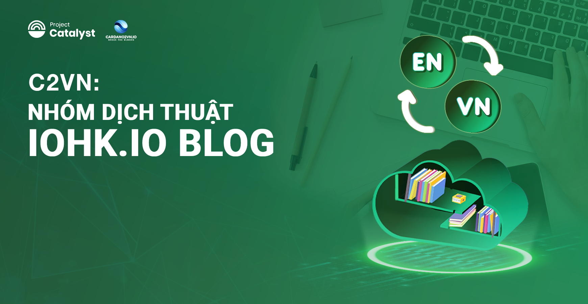

Giới thiệu Blog-iohk
============

Đây là cổng thông tin chiến lược và kỹ thuật từ trang web IOHK (iohk.io) cần được truyền tải đến cộng đồng Việt Nam một cách thân thiện.

## Bài dịch mới nhất

[**Ví nhẹ mới của IOG - hiện đang trong quá trình phát triển - sẽ giúp thúc đẩy việc áp dụng bằng cách cung cấp khả năng nâng cao và dễ sử dụng cho người dùng tiền mã hóa**](https://cardano2vn.io/docs1/2022/06/2022-06-10-lace-speed-simplicity-and-seamless-flow)

-------------------------------------------

## Danh sách các bài đã dịch 

Các bài đã dịch năm 2022

## Các bài đã dịch năm 2022

### Bài viết trong tháng 08 năm 2022
>[Giải thích về Ofelimos](https://cardano2vn.io/docs1/2022/08/2022-08-18-ofelimos-explained)
>
>[Kachina: hợp đồng thông minh bảo vệ quyền riêng tư](https://cardano2vn.io/docs1/2022/08/2022-08-05-kachina-privacy-preserving-smart-contracts/)
>
>[Những điều cần biết về Layer 1 & Layer 2](https://cardano2vn.io/docs1/2022/08/2022-08-05-layer-1-layer-2-all-you-need-to-know/)
>
>[Giới thiệu Ofelimos - giao thức đồng thuận bằng chứng công việc hữu ích - PoUW](https://cardano2vn.io/docs1/2022/08/2022-08-16-introducing-ofelimos-a-proof-of-useful-work-consensus-protocol)
 
### Bài viết trong tháng 07 năm 2022
 >
 [Cardano sắp nâng cấp Vasil: điều gì sẽ xảy ra
](https://cardano2vn.io/docs1/2022/07/2022-07-04-cardano-s-approaching-vasil-upgrade-what-to-expect)
>
[Phân tích về khả năng mở rộng của Cardano](https://cardano2vn.io/docs1/2022/07/2022-07-19-an-analysis-of-the-research-underpinning-cardanos-scalability)
>
 >[Ủy quyền của n](https://cardano2vn.io/docs1/2022/07/2022-07-28-staking-is-the-bedrock-of-cardano)
 >
 >[Những cầu nối và sidechains](https://cardano2vn.io/docs1/2022/07/2022-07-08-bridges-and-sidechains-wanchain-making-cardano-interoperable/)
 >
 >[Tổng quan nghiên cứu phần 3: Token-Stablecoin-Phí](https://cardano2vn.io/docs1/2022/07/2022-07-07-research-overview-part-3-tokens-stablecoins-and-fees)
 >
 >[Dữ liệu Cardano trên BigQuery](https://cardano2vn.io/docs1/2022/07/2022-07-01-cardano-data-on-bigquery/)
 
### Bài viết trong tháng 06 năm 2022
>
>[Cập nhật về nâng cấp Vasil](https://cardano2vn.io/docs1/2022/06/2022-06-20-vasil-upgrade-the-state-of-play)
>
[Tổng quan về nghiên cứu cho phép hỗ trợ hợp đồng thông minh trên Cardano
](https://cardano2vn.io/docs1/2022/06/2022-06-23-overview-of-the-research-enabling-smart-contract-support-on-cardano)
>
>[Từ Classic đến Chronos: Giải mã việc triển khai Ouroboros](https://cardano2vn.io/docs1/2022/06/2022-06-03-from-classic-to-chronos-the-implementations-of-ouroboros-explained)
>
> [Tổng quan nghiên cứu mang tính nền tảng của Cardano](https://cardano2vn.io/docs1/2022/06/2022-06-10-cardanos-foundational-research-overview/)
> 
> [Ví nhẹ Lace: tốc độ, đơn giản và thông suốt](https://cardano2vn.io/docs1/2022/06/2022-06-10-lace-speed-simplicity-and-seamless-flow/)
> 
> [Trang Tài liệu Cộng đồng về Plutus](https://cardano2vn.io/docs1/2022/06/2022-06-08-plutus-community-docs-a-new-documentation-site-for-devs-by-devs/)
> 
> [DISH ra mắt hệ thống nhận dạng phi tập trung](https://cardano2vn.io/docs1/2022/06/2022-06-07-dish-launches-decentralized-identification-and-loyalty-coin-system-built-on-input-output-global-iog-technology/)
> 
> [Cardano tại hội nghị đồng thuận: nhìn về tương lai](https://cardano2vn.io/docs1/2022/06/2022-06-06-cardano-at-consensus-a-look-ahead/)
> 
> [Fund9 thử thách Catalyst Natives Cardashift: demonstrating and monetizing impact](https://cardano2vn.io/docs1/2022/06/2022-06-01-fund9-catalyst-natives-cardashift-challenge-demonstrating-and-monetizing-impact/)

### Bài viết trong tháng 05 năm 2022
> 
>[Những điều bạn luôn muốn biết mà ngại đặt câu hỏi về Tổn thất tạm thời (Impermanent Loss)](https://cardano2vn.io/docs1/2022/05/2022-05-27-everything-you-always-wanted-to-know-about-impermanent-loss-and-were-afraid-to-ask/)
>
>[Học cách tạo hợp đồng thông minh cho lĩnh vực tài chính với chi phí thấp và giảm thiểu viết code trong Chương trình tiên phong của Marlowe](https://cardano2vn.io/docs1/2022/05/2022-05-11-learn-how-to-create-low-code-low-cost-financial-smart-contracts-in-the-marlowe-pioneers-program/)
>
>[Project Catalyst - Một chu trình phát triển hệ sinh thái Cardano](https://cardano2vn.io/docs1/2022/05/2022-05-10-project-catalyst-a-virtuous-cycle-of-cardano-ecosystem-development-investing-in-great-ideas-to-make-positive-real-world-changes/)
>
>[Atala SCAN: xác thực sản phẩm dựa trên blockchain](https://cardano2vn.io/docs1/2022/05/2022-05-04-atala-scan-blockchain-based-product-authentication/)

### Bài viết trong tháng 04 năm 2022
>
>[Khả năng tương tác là chìa khóa để phát triển blockchain](https://cardano2vn.io/docs1/2022/04/2022-04-28-interoperability-is-key-to-blockchain-growth/)
>
>[Guest Blog: hợp tác dựa trên khả năng tương tác của Cardano](https://cardano2vn.io/docs1/2022/04/2022-04-27-guest-blog-collaborating-on-cardano-interoperability/) 
>
>[Giới thiệu công cụ giao diện dòng lệnh (cli) mới cho Marlowe](https://cardano2vn.io/docs1/2022/04/2022-04-19-introducing-the-new-command-line-interface-tool-for-marlowe/)
>
>[Tăng cường thông lượng của Cardano với Tập lệnh tham chiếu](https://cardano2vn.io/docs1/2022/04/2022-04-13-boosting-cardano-s-throughput-with-script-referencing/)
>
>[Giới thiệu ủy quyền vote(dRep)](https://cardano2vn.io/docs1/2022/04/2022-04-11-introducing-the-concept-of-delegate-representatives-dreps)

### Bài viết trong tháng 03 năm 2022
>
>[Wave Financial ra mắt quỹ ADA yield](https://cardano2vn.io/docs1/2022/03/2022-03-31-wave-financial-launches-ada-yield-fund-to-support-cardanos-defi-ecosystem-growth)
>
>[Tăng thông lươngj giao gicj của Cardano](https://cardano2vn.io/docs1/2022/03/2022-03-21-increasing-the-transaction-throughput-of-cardano)
>
>[Vai trò quan trọng của AI/blockchain trong tương lai](https://cardano2vn.io/docs1/2022/03/2022-03-30-the-critical-role-of-ai-blockchain-synergy-in-humanity-s-future/)
>
>[Tăng thông lượng giao dịch của Cardano](https://cardano2vn.io/docs1/2022/03/2022-03-21-increasing-the-transaction-throughput-of-cardano/)
>
>[Tìm hiểu sâu hơn về Sân chơi Marlowe](https://cardano2vn.io/docs1/2022/03/2022-03-04-diving-deeper-into-the-marlowe-playground/)
>
>[Giới thiệu dự án Catalyst Fund8](https://cardano2vn.io/docs1/2022/03/2022-03-02-project-catalyst-cardano-s-innovation-engine-launches-fund8)

### Bài viết trong tháng 02 năm 2022
>[Từ  việc cải tiến node đến việc node được đóng block… Bản phát hành tháng 2 của Cardano](https://cardano2vn.io/docs1/2022/02/2022-02-28-from-node-enhancement-to-block-leadership-cardano-s-february-release)
>
>[Cơ sở kiến thức về Cardano đang ngày càng phát triển](https://cardano2vn.io/docs1/2022/02/2022-02-07-the-knowledge-base-for-cardano-is-growing-cardano-stack-exchange-graduates-from-beta-version/)
>
>[Triển khai Hydra Heads](https://cardano2vn.io/docs1/2022/02/2022-02-03-implementing-hydra-heads-the-first-step-towards-the-full-hydra-vision/)
>
>[Giới thiệu pipelining (phát tán đồng thời)](https://cardano2vn.io/docs1/2022/02/2022-02-01-introducing-pipelining-cardanos-consensus-layer-scaling-solution/)

### Bài viết trong tháng 01 năm 2022
>[Các bài kiểm tra thuộc tính đơn giản cho trình xác thực Plutus](https://cardano2vn.io/docs1/2022/01/2022-01-27-simple-property-based-tests-for-plutus-validators)
>
>[Công cụ ước tính phí Plutus trên Cardano](https://cardano2vn.io/docs1/2022/01/2022-01-21-plutus-fee-estimator-find-out-the-cost-of-transacting-on-cardano/)
>
>[Cốt lõi của mạng lưới Cardano đang phát triển nhanh chóng](https://cardano2vn.io/docs1/2022/01/2022-01-19-the-beating-heart-of-a-fast-growing-network/)
>
>[Cách chúng tôi mở rộng quy mô Cardano trong năm 2022](https://cardano2vn.io/docs1/2022/01/2022-01-14-how-we-re-scaling-cardano-in-2022/)
>
>[Bộ phận Developer Experience (DevX) của IOG sẽ cải thiện nhanh hơn khả năng phát triển](https://cardano2vn.io/docs1/2022/01/2022-01-13-a-new-internal-iog-developer-experience-department/)
>
>[Giải mã tài chính phi tập trung (DeFi)](https://cardano2vn.io/docs1/2022/01/2022-01-10-defi-demystified/)

 

Các bài đã dịch năm 2021

## Các bài đã dịch năm 2021

### Bài viết trong tháng 12 năm 2021
>[Giới thiệu mạng thử nghiệm ngang hàng (P2P) mới](https://cardano2vn.io/docs1/2021/12/2021-12-08-introducing-our-new-peer-to-peer-p2p-testnet)

>[Khi nói đến DeFi, Bạn hãy tự nghiên cứu](https://cardano2vn.io/docs1/2021/12/2021-12-09-when-it-comes-to-defi-do-your-own-research)

>[2021: Năm của những người tiên phong trong giáo dục](https://cardano2vn.io/docs1/2021/12/2021-12-23-cardano-education-in-2021-the-year-of-the-pioneers)

>[Năm 2021: Năm rô bốt và graffiti đến với Cardano phi tập trung và thông minh hơn](https://cardano2vn.io/docs1/2021/12/2021-12-27-review-of-2021-the-year-fun-came-to-cardano-with-beeple-nfts-robots-and-blockchain-graffiti)

### Bài viết trong tháng 11 năm 2021

>[Trao quyền cho thế hệ các nhà đổi mới ở Ghana](https://cardano2vn.io/docs1/2021/11/2021-11-05-empowering-a-new-generation-of-innovators-in-ghana)

>[Hợp tác mới để tiếp tục đà tăng trưởng cho các blockchain sử dụng UTXO](https://cardano2vn.io/docs1/2021/11/2021-11-09-utxo-blockchains-continue-forward-momentum-with-new-collaborations)

>[Bộ chuyển đổi ERC20 hiện đang hoạt động trên Testnet](https://cardano2vn.io/docs1/2021/12/2021-12-07-the-agix-erc20-converter-testnet-is-now-live)

### Bài viết trong tháng 10 năm 2021

>[Tóm tắt hội nghị thượng đỉnh Cardano 2021: Điều quan trọng tiếp theo là Quản trị](https://cardano2vn.io/docs1/2021/10/2021-10-08-cardano-summit-2021-summary-governance-is-the-next-big-thing)

>[Liên minh UTXO: Thúc đẩy sự đổi mới và hợp tác trong lĩnh vực Blockchain](https://cardano2vn.io/docs1/2021/10/2021-10-15-utxo-alliance-fostering-innovation-and-collaboration-across-the-blockchain-space)

>[ Châu Phi là nơi những khó khăn được khắc phục
](https://cardano2vn.io/docs1/2021/10/2021-10-26-africa-is-where-the-tough-get-going)

>[Mithril: Một Blockchain Mạnh và nhẹ hơn để đạt hiệu qua hơn.](https://cardano2vn.io/docs1/2021/10/2021-10-29-mithril-a-stronger-and-lighter-blockchain-for-better-efficiency)

### Bài viết trong tháng 09 năm 2021

>[Thỏa thuận Oasis Pro sẽ giúp các nước đang phát triển tiếp cận thị trường tài chính tốt hơn
](https://cardano2vn.io/docs1/2021/09/2021-09-26-cardano-deal-with-oasis-will-give-developing-world-better-access-to-financial-markets)

>[Nhà cung cấp dịch vụ di động Hoa Kỳ hợp tác với Cardano](https://cardano2vn.io/docs1/2021/09/2021-09-28-boost-mobile-and-dish-tv-call-on-cardano)

>[IOG thiết lập quan hệ đối tác chiến lược với Acuant nhằm nâng cao khả năng bảo mật trong không gian DeFi với Atala PRISM](https://cardano2vn.io/docs1/2021/09/2021-09-29-acuants-new-strategic-partnership-with-iog-and-atala-prism-to-offer-enhanced-security-in-the-defi-space)

-------------------------------------------

Danh sách dịch thuật cho dự án IOHK-BLOG

1. Nguyễn Văn Hiệu. 
2. Nguyễn Anh Tiến.
3. Phan Quốc.
4. Phạm Quang.
5. Kim Chi.
6. LinhPool.
7. Max Long.
8. Lenguyen.
9. Ngoluuduythai.
10. Hoangtrandesigner.
11. Tulibra1510.
12. Minh Hieu.

Danh sách Review

1. Nguyễn Văn Hiệu. 
2. Nguyễn Anh Tiến.
3. Phan Quốc.
4. Phạm Quang.

-------------------------------------------
*Đây là Blog dịch từ [iohk-Blog](https://iohk.io/en/blog/posts/page-1/)*
